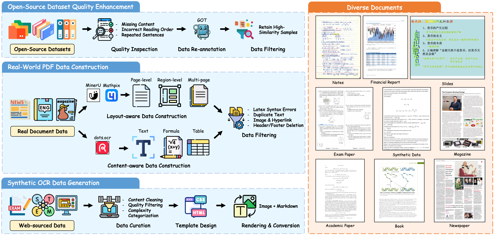
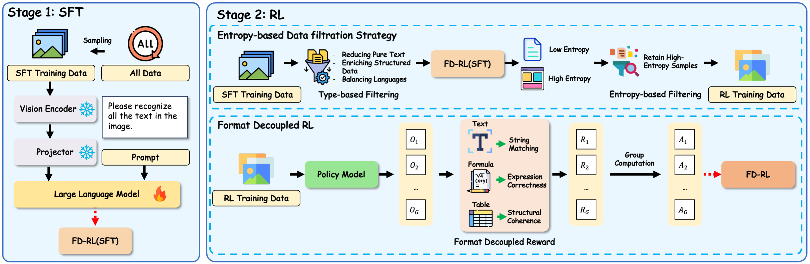

<div align="center">
  <h1>Reading or Reasoning? Format Decoupled Reinforcement Learning for Document OCR
</h1>
</div>

<div align="center">
<!-- <a href=''></a>&ensp;
<a href=''></a>&ensp; -->
<a href=https://github.com/tatsu-lab/stanford_alpaca/blob/main/LICENSE></a>
<!-- Lei Chen, Xuanle Zhao, Zhixiong Zeng†, Jing Huang, Yufeng Zhong, Lin Ma* -->
</div>

# 📢 News and Updates
* ```2025.11.17``` We upload our model weights [FD-RL](https://huggingface.co/DocTron/FD-RL) to HuggingFace.

# 🤗 Models
|  Model   | Download Link  |
|  ----  | ----  |
|  FD-RL |  [DocTron/FD-RL](https://huggingface.co/DocTron/FD-RL)  |

# 📚 Dataset
Overview of our training data construction pipeline. We construct the dataset via (1) open-source dataset quality enhancement, (2) real-world PDF construction, and (3) synthetic OCR data generation, yielding a large-scale dataset covering nine common document categories: notes, financial reports, slides, exam papers, synthetic data, magazines, academic papers, books, and newspapers.


# 🤖 Pipeline
Overview of the FD-RL training pipeline. Our approach comprises two stages: Stage 1 (SFT) trains FD-RL(SFT) on large-scale document data via supervised fine-tuning, freezing the vision encoder and projector while updating the large language model. Stage 2 (RL) introduces two innovations: (1) Entropy-based data filtration strategy that filters data through type-based filtering (enriching structured data and balancing languages) and entropy-based filtering (retaining high-entropy samples), and (2) Format decoupled RL using separately for different content types: string matching reward for plain text, expression correctness reward for formulas, and structural coherence reward for tables.


# 📊 Performance
FD-RL is evaluated on OmniDocBench v1.5, a comprehensive document OCR benchmark covering diverse real-world scenarios (e.g., office documents, academic papers, scanned materials). Results show that FD-RL achieves the best performance among end-to-end VLMs, demonstrating the effectiveness of our Format Decoupled RL approach.

## End-to-End Evaluation

We conduct an end-to-end evaluation to measure the model's parsing accuracy on PDF page content. The prediction is derived from the model's Markdown output generated by parsing the entire PDF page. The Overall metric is defined as:

$$
\text{Overall} = \frac{(1-\text{Text }^\text{Edit Distance}) \times 100 + \text{Formula}^{\text{CDM}} + \text{Table}^{\text{TEDS}}}{3}
$$

<table>
  <thead>
    <tr>
      <th>Model Type</th>
      <th>Methods</th>
      <th>Release Date</th>
      <th>End to End</th>
      <th>Parameters</th>
      <th>Overall↑</th>
      <th>Text<sup>Edit</sup>↓</th>
      <th>Formula<sup>CDM</sup>↑</th>
      <th>Table<sup>TEDS</sup>↑</th>
      <th>Table<sup>TEDS-S</sup>↑</th>
      <th>Reading Order<sup>Edit</sup>↓</th>
    </tr>
  </thead>
  <tbody>
    <!-- Pipeline Tools -->
    <tr>
      <td rowspan="3">Pipeline Tools</td>
      <td>Marker-1.8.2</td>
      <td>2025</td>
      <td>❌</td>
      <td>-</td>
      <td>71.30</td>
      <td>0.206</td>
      <td>76.66</td>
      <td>57.88</td>
      <td>71.17</td>
      <td>0.250</td>
    </tr>
    <tr>
      <td>Mineru2-pipeline</td>
      <td>2025</td>
      <td>❌</td>
      <td>-</td>
      <td>75.51</td>
      <td>0.209</td>
      <td>76.55</td>
      <td>70.90</td>
      <td>79.11</td>
      <td>0.225</td>
    </tr>
    <tr>
      <td>PP-StructureV3</td>
      <td>2025</td>
      <td>❌</td>
      <td>-</td>
      <td>86.73</td>
      <td>0.073</td>
      <td>85.79</td>
      <td>81.68</td>
      <td>89.48</td>
      <td>0.073</td>
    </tr>
    <!-- General VLMs -->
    <tr>
      <td rowspan="5">General VLMs</td>
      <td>GPT-4o</td>
      <td>2023</td>
      <td>✅</td>
      <td>-</td>
      <td>75.02</td>
      <td>0.217</td>
      <td>79.70</td>
      <td>67.07</td>
      <td>76.09</td>
      <td>0.148</td>
    </tr>
    <tr>
      <td>InternVL3-76B</td>
      <td>2025</td>
      <td>✅</td>
      <td>76B</td>
      <td>80.33</td>
      <td>0.131</td>
      <td>83.42</td>
      <td>70.64</td>
      <td>77.74</td>
      <td>0.113</td>
    </tr>
    <tr>
      <td>InternVL3.5-241B</td>
      <td>2025</td>
      <td>✅</td>
      <td>241B</td>
      <td>82.67</td>
      <td>0.142</td>
      <td>87.23</td>
      <td>75.00</td>
      <td>81.28</td>
      <td>0.125</td>
    </tr>
    <tr>
      <td>Qwen2.5-VL-72B</td>
      <td>2025</td>
      <td>✅</td>
      <td>72B</td>
      <td>87.02</td>
      <td>0.094</td>
      <td>88.27</td>
      <td>82.15</td>
      <td>86.22</td>
      <td>0.102</td>
    </tr>
    <tr>
      <td>Gemini-2.5 Pro</td>
      <td>2025</td>
      <td>✅</td>
      <td>-</td>
      <td>88.03</td>
      <td>0.075</td>
      <td>85.82</td>
      <td>85.71</td>
      <td>90.29</td>
      <td>0.097</td>
    </tr>
    <!-- Specialized VLMs: End to End ❌ -->
    <tr>
      <td rowspan="15">Specialized VLMs</td>
      <td>Dolphin</td>
      <td>2025.05</td>
      <td>❌</td>
      <td>322M</td>
      <td>74.67</td>
      <td>0.125</td>
      <td>67.85</td>
      <td>68.70</td>
      <td>77.77</td>
      <td>0.124</td>
    </tr>
    <tr>
      <td>MinerU2-VLM</td>
      <td>2025.06</td>
      <td>❌</td>
      <td>0.9B</td>
      <td>85.56</td>
      <td>0.078</td>
      <td>80.95</td>
      <td>83.54</td>
      <td>87.66</td>
      <td>0.086</td>
    </tr>
    <tr>
      <td>MonkeyOCR-pro-1.2B</td>
      <td>2025.07</td>
      <td>❌</td>
      <td>1.9B</td>
      <td>86.96</td>
      <td>0.084</td>
      <td>85.02</td>
      <td>84.24</td>
      <td>89.02</td>
      <td>0.130</td>
    </tr>
    <tr>
      <td>MonkeyOCR-3B</td>
      <td>2025.07</td>
      <td>❌</td>
      <td>3.7B</td>
      <td>87.13</td>
      <td>0.075</td>
      <td>87.45</td>
      <td>81.39</td>
      <td>85.92</td>
      <td>0.129</td>
    </tr>
    <tr>
      <td>MonkeyOCR-pro-3B</td>
      <td>2025.07</td>
      <td>❌</td>
      <td>3.7B</td>
      <td>88.85</td>
      <td>0.075</td>
      <td>87.25</td>
      <td>86.78</td>
      <td>90.63</td>
      <td>0.128</td>
    </tr>
    <tr>
      <td>MinerU2.5</td>
      <td>2025.09</td>
      <td>❌</td>
      <td>1.2B</td>
      <td>90.67</td>
      <td>0.047</td>
      <td>88.46</td>
      <td>88.22</td>
      <td>92.38</td>
      <td>0.044</td>
    </tr>
    <tr>
      <td>PaddleOCR-VL</td>
      <td>2025.10</td>
      <td>❌</td>
      <td>0.9B</td>
      <td>92.56</td>
      <td>0.035</td>
      <td>91.43</td>
      <td>89.76</td>
      <td>93.52</td>
      <td>0.043</td>
    </tr>
    <!-- Specialized VLMs: End to End ✅ -->
    <tr>
      <td>OCRFlux-3B</td>
      <td>2025.06</td>
      <td>✅</td>
      <td>3B</td>
      <td>74.82</td>
      <td>0.193</td>
      <td>68.03</td>
      <td>75.75</td>
      <td>80.23</td>
      <td>0.202</td>
    </tr>
    <tr>
      <td>Mistral OCR</td>
      <td>2025.03</td>
      <td>✅</td>
      <td>-</td>
      <td>78.83</td>
      <td>0.164</td>
      <td>82.84</td>
      <td>70.03</td>
      <td>78.04</td>
      <td>0.144</td>
    </tr>
    <tr>
      <td>POINTS-Reader</td>
      <td>2025.08</td>
      <td>✅</td>
      <td>3B</td>
      <td>80.98</td>
      <td>0.134</td>
      <td>79.20</td>
      <td>77.13</td>
      <td>81.66</td>
      <td>0.145</td>
    </tr>
    <tr>
      <td>olmOCR-7B</td>
      <td>2025.02</td>
      <td>✅</td>
      <td>7B</td>
      <td>81.79</td>
      <td>0.096</td>
      <td>86.04</td>
      <td>68.92</td>
      <td>74.77</td>
      <td>0.121</td>
    </tr>
    <tr>
      <td>Nanonets-OCR-s</td>
      <td>2025.06</td>
      <td>✅</td>
      <td>3B</td>
      <td>85.59</td>
      <td>0.093</td>
      <td>85.90</td>
      <td>80.14</td>
      <td>85.57</td>
      <td>0.108</td>
    </tr>
    <tr>
      <td>Deepseek-OCR</td>
      <td>2025.10</td>
      <td>✅</td>
      <td>3B</td>
      <td>87.01</td>
      <td>0.073</td>
      <td>83.37</td>
      <td>84.97</td>
      <td>88.80</td>
      <td>0.086</td>
    </tr>
    <tr>
      <td>dots.ocr</td>
      <td>2025.07</td>
      <td>✅</td>
      <td>3B</td>
      <td>88.41</td>
      <td>0.048</td>
      <td>83.22</td>
      <td>86.78</td>
      <td>90.62</td>
      <td>0.053</td>
    </tr>
    <tr>
      <td>FD-RL</td>
      <td>2025.11</td>
      <td>✅</td>
      <td>4B</td>
      <td>90.41</td>
      <td>0.049</td>
      <td>88.67</td>
      <td>87.35</td>
      <td>92.10</td>
      <td>0.055</td>
    </tr>
  </tbody>
</table>

## Performance Across Diverse Page Types

To better understand the FD-RL model's capabilities across different document scenarios, the following table reports its text recognition performance (Edit Distance) on 9 document types. This category-wise analysis helps identify the model's strengths and weaknesses in handling diverse real-world documents.

<table>
    <thead>
        <tr>
            <th>Model Type</th>
            <th>Models</th>
            <th>End to End</th>
            <th>Slides</th>
            <th>Academic Papers</th>
            <th>Book</th>
            <th>Textbook</th>
            <th>Exam Papers</th>
            <th>Magazine</th>
            <th>Newspaper</th>
            <th>Notes</th>
            <th>Financial Report</th>
        </tr>
    </thead>
    <tbody>
        <tr>
            <td rowspan="3">Pipeline Tools</td>
            <td>Marker-1.8.2</td>
            <td>❌</td>
            <td>0.1796</td>
            <td>0.0412</td>
            <td>0.1010</td>
            <td>0.2908</td>
            <td>0.2958</td>
            <td>0.1111</td>
            <td>0.2717</td>
            <td>0.4656</td>
            <td>0.0341</td>
        </tr>
        <tr>
            <td>MinerU2-pipeline</td>
            <td>❌</td>
            <td>0.4244</td>
            <td>0.0230</td>
            <td>0.2628</td>
            <td>0.1224</td>
            <td>0.0822</td>
            <td>0.395</td>
            <td>0.0736</td>
            <td>0.2603</td>
            <td>0.0411</td>
        </tr>
        <tr>
            <td>PP-StructureV3</td>
            <td>❌</td>
            <td>0.0794</td>
            <td>0.0236</td>
            <td>0.0415</td>
            <td>0.1107</td>
            <td>0.0945</td>
            <td>0.0722</td>
            <td>0.0617</td>
            <td>0.1236</td>
            <td>0.0181</td>
        </tr>
        <tr>
            <td rowspan="5">General VLMs</td>
            <td>GPT-4o</td>
            <td>✅</td>
            <td>0.1019</td>
            <td>0.1203</td>
            <td>0.1288</td>
            <td>0.1599</td>
            <td>0.1939</td>
            <td>0.142</td>
            <td>0.6254</td>
            <td>0.2611</td>
            <td>0.3343</td>
        </tr>
        <tr>
            <td>InternVL3-76B</td>
            <td>✅</td>
            <td>0.0349</td>
            <td>0.1052</td>
            <td>0.0629</td>
            <td>0.0827</td>
            <td>0.1007</td>
            <td>0.0406</td>
            <td>0.5826</td>
            <td>0.0924</td>
            <td>0.0665</td>
        </tr>
        <tr>
            <td>InternVL3.5-241B</td>
            <td>✅</td>
            <td>0.0475</td>
            <td>0.0857</td>
            <td>0.0237</td>
            <td>0.1061</td>
            <td>0.0933</td>
            <td>0.0577</td>
            <td>0.6403</td>
            <td>0.1357</td>
            <td>0.1117</td>
        </tr>
        <tr>
            <td>Qwen2.5-VL-72B</td>
            <td>✅</td>
            <td>0.0422</td>
            <td>0.0801</td>
            <td>0.0586</td>
            <td>0.1146</td>
            <td>0.0681</td>
            <td>0.0964</td>
            <td>0.238</td>
            <td>0.1232</td>
            <td>0.0264</td>
        </tr>
        <tr>
            <td>Gemini-2.5 Pro</td>
            <td>✅</td>
            <td>0.0326</td>
            <td>0.0182</td>
            <td>0.0694</td>
            <td>0.1618</td>
            <td>0.0937</td>
            <td>0.0161</td>
            <td>0.1347</td>
            <td>0.1169</td>
            <td>0.0169</td>
        </tr>
        <tr>
            <td rowspan="12" style="vertical-align: middle;">Specialized VLMs</td>
            <td>Dolphin</td>
            <td>❌</td>
            <td>0.0957</td>
            <td>0.0453</td>
            <td>0.0616</td>
            <td>0.1333</td>
            <td>0.1684</td>
            <td>0.0702</td>
            <td>0.2388</td>
            <td>0.2561</td>
            <td>0.0186</td>
        </tr>
        <tr>
            <td>MinerU2-VLM</td>
            <td>❌</td>
            <td>0.0745</td>
            <td>0.0104</td>
            <td>0.0357</td>
            <td>0.1276</td>
            <td>0.0698</td>
            <td>0.0652</td>
            <td>0.1831</td>
            <td>0.0803</td>
            <td>0.0236</td>
        </tr>
        <tr>
            <td>MonkeyOCR-pro-1.2B</td>
            <td>❌</td>
            <td>0.0961</td>
            <td>0.0354</td>
            <td>0.053</td>
            <td>0.111</td>
            <td>0.0887</td>
            <td>0.0494</td>
            <td>0.0995</td>
            <td>0.1686</td>
            <td>0.0198</td>
        </tr>
        <tr>
            <td>MonkeyOCR-pro-3B</td>
            <td>❌</td>
            <td>0.0904</td>
            <td>0.0362</td>
            <td>0.0489</td>
            <td>0.1072</td>
            <td>0.0745</td>
            <td>0.0475</td>
            <td>0.0962</td>
            <td>0.1165</td>
            <td>0.0196</td>
        </tr>
        <tr>
            <td>MinerU2.5</td>
            <td>❌</td>
            <td>0.0294</td>
            <td>0.0235</td>
            <td>0.0332</td>
            <td>0.0499</td>
            <td>0.0681</td>
            <td>0.0316</td>
            <td>0.054</td>
            <td>0.1161</td>
            <td>0.0104</td>
        </tr>
        <tr>
            <td>OCRFlux</td>
            <td>✅</td>
            <td>0.0870</td>
            <td>0.0867</td>
            <td>0.0818</td>
            <td>0.1843</td>
            <td>0.2072</td>
            <td>0.1048</td>
            <td>0.7304</td>
            <td>0.1567</td>
            <td>0.0193</td>
        </tr>
        <tr>
            <td>Mistral-OCR</td>
            <td>✅</td>
            <td>0.0917</td>
            <td>0.0531</td>
            <td>0.0610</td>
            <td>0.1341</td>
            <td>0.1341</td>
            <td>0.0581</td>
            <td>0.5643</td>
            <td>0.3097</td>
            <td>0.0523</td>
        </tr>
        <tr>
            <td>POINTS-Reader</td>
            <td>✅</td>
            <td>0.0334</td>
            <td>0.0779</td>
            <td>0.0671</td>
            <td>0.1372</td>
            <td>0.1901</td>
            <td>0.1343</td>
            <td>0.3789</td>
            <td>0.0937</td>
            <td>0.0951</td>
        </tr>
        <tr>
            <td>olmOCR-7B</td>
            <td>✅</td>
            <td>0.0497</td>
            <td>0.0365</td>
            <td>0.0539</td>
            <td>0.1204</td>
            <td>0.0728</td>
            <td>0.0697</td>
            <td>0.2916</td>
            <td>0.122</td>
            <td>0.0459</td>
        </tr>
        <tr>
            <td>Nanonets-OCR-s</td>
            <td>✅</td>
            <td>0.0551</td>
            <td>0.0578</td>
            <td>0.0606</td>
            <td>0.0931</td>
            <td>0.0834</td>
            <td>0.0917</td>
            <td>0.1965</td>
            <td>0.1606</td>
            <td>0.0395</td>
        </tr>
        <tr>
            <td>dots.ocr</td>
            <td>✅</td>
            <td>0.0290</td>
            <td>0.0231</td>
            <td>0.0433</td>
            <td>0.0788</td>
            <td>0.0467</td>
            <td>0.0221</td>
            <td>0.0667</td>
            <td>0.1116</td>
            <td>0.0076</td>
        </tr>
        <tr>
            <td>FD-RL</td>
            <td>✅</td>
            <td>0.0235</td>
            <td>0.0258</td>
            <td>0.0300</td>
            <td>0.0867</td>
            <td>0.0464</td>
            <td>0.0235</td>
            <td>0.1069</td>
            <td>0.0881</td>
            <td>0.0091</td>
        </tr>
    </tbody>
</table>

# 🔍 Usage Example

## Inference

This below is a simple example of how to use FD-RL for document parsing tasks.

Please first install [transformers](https://github.com/huggingface/transformers) using the following command:

```shell
pip install "transformers>=4.57.0"
```

```python
from transformers import Qwen3VLForConditionalGeneration, AutoProcessor
import torch

# Load model
model_path = 'DocTron/FD-RL'
model = Qwen3VLForConditionalGeneration.from_pretrained(
    model_path,
    dtype="auto", 
    device_map="cuda",
    trust_remote_code=True
)
processor = AutoProcessor.from_pretrained(model_path, trust_remote_code=True)

# Prepare input with image and text
image_path = "./assets/FD-RL_test.jpg"
# We recommend using the following prompt to better performance, since it is used throughout the training process.
prompt = "Extract the main content from the document in the image, keeping the original structure. Convert all formulas to LaTeX and all tables to HTML."

messages = [
    {
        "role": "user",
        "content": [
            {"type": "image", "image": image_path},
            {"type": "text", "text": prompt},
        ]
    }
]

# Preparation for inference
inputs = processor.apply_chat_template(
    messages, 
    tokenize=True, 
    add_generation_prompt=True,
    return_dict=True,
    return_tensors="pt"
)
inputs = inputs.to(model.device)

# Inference: Generation of the output
generated_ids = model.generate(**inputs, max_new_tokens=8192, do_sample=False)

generated_ids = [
    output_ids[len(input_ids):] for input_ids, output_ids in zip(inputs.input_ids, generated_ids)
]
output_text = processor.tokenizer.batch_decode(
    generated_ids, skip_special_tokens=True, clean_up_tokenization_spaces=False
)
print(output_text[0])

# $$
# r = \frac{\alpha}{\beta} \sin \beta (\sigma_1 \pm \sigma_2)
# $$
```

## Fine-tuning

### SFT
For users interested in further fine-tuning our model, we suggest employing Llama Factory. Complete installation and usage information is documented in the official repository. Below we present an example fine-tuning configuration:

```shell
PROJECT_DIR=/path/to/llama_factory
cd ${PROJECT_DIR}

# Set parameters
GPUS_PER_NODE=8                  # Number of GPUs per node
NNODES=1                         # Total number of nodes
NODE_RANK=0                      # Rank of the current node (starts from 0)
MASTER_ADDR=localhost            # IP address of the master node
MASTER_PORT=12345                # Port for communication between nodes

MODEL_DIR=/path/to/ocrverse_text_model  # Path to the pre-trained OCRVerse model
DATA=/name/of/your/dataset               # Name/path of your custom dataset
OUTPUT_DIR=/path/to/output              # Directory to save fine-tuned results

# Llama Factory-based fine-tuning script
torchrun --nproc_per_node="${GPUS_PER_NODE}" --nnodes="${NNODES}" --node_rank="${NODE_RANK}" --master_addr="${MASTER_ADDR}" --master_port="${MASTER_PORT}" \
    src/train.py \
    --model_name_or_path "$MODEL_DIR" \
    --stage sft \
    --do_train True \
    --finetuning_type full \
    --dataset "$DATA" \
    --template qwen3_vl_nothink \
    --cutoff_len 8192 \
    --preprocessing_num_workers 128 \
    --preprocessing_batch_size 256 \
    --dataloader_num_workers 128 \
    --output_dir "$OUTPUT_DIR" \
    --logging_steps 1 \
    --save_steps 5000 \
    --plot_loss True \
    --save_only_model False \
    --report_to none \
    --per_device_train_batch_size 1 \
    --gradient_accumulation_steps 1 \
    --learning_rate 1e-5 \
    --num_train_epochs 1 \
    --lr_scheduler_type cosine \
    --warmup_ratio 0.1 \
    --bf16 True
```

<!-- ### RL -->

# 📌 Acknowledgement
We sincerely appreciate [LLaMA-Factory](https://github.com/hiyouga/LLaMA-Factory) for providing reference training framework.


<!-- ## 📖 Citation
If you find this project useful, please feel free to leave a star and cite our paper:
```
@misc{chen2025chartr1,
      title={Chart-R1: Chain-of-Thought Supervision and Reinforcement for Advanced Chart Reasoner}, 
      author={Lei Chen and Xuanle Zhao and Zhixiong Zeng and Jing Huang and Yufeng Zhong and Lin Ma},
      year={2025},
      eprint={2507.15509},
      archivePrefix={arXiv},
      primaryClass={cs.AI},
      url={https://arxiv.org/abs/2507.15509}, 
}
``` -->
